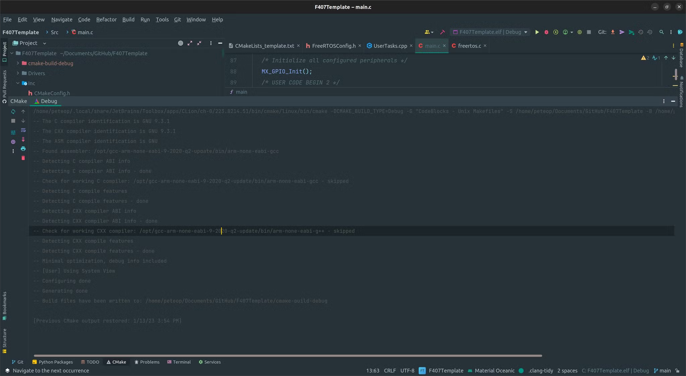
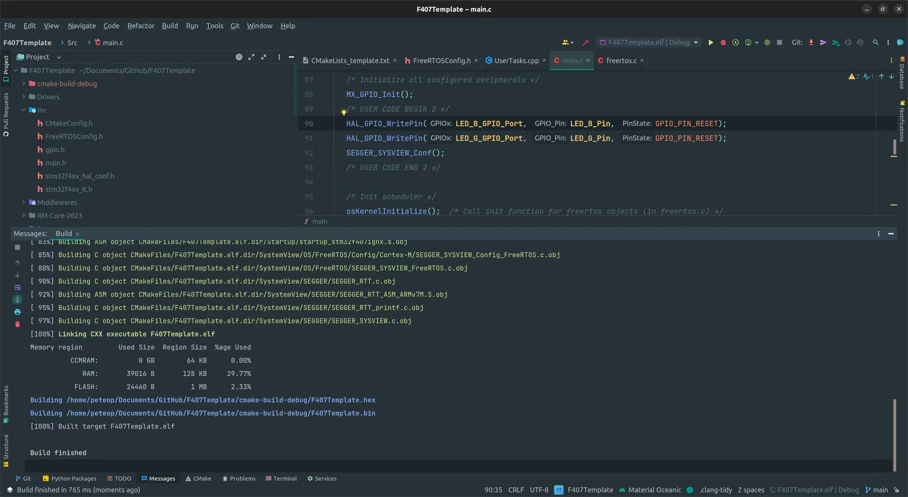
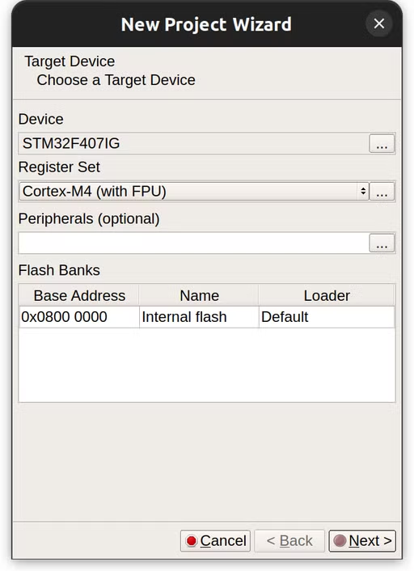
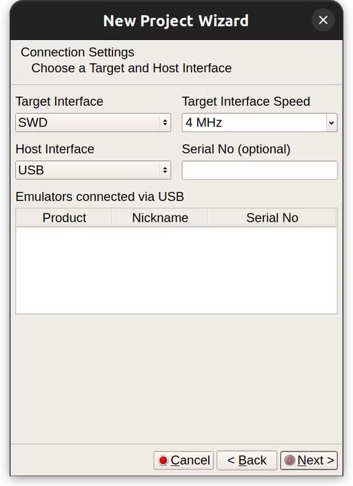
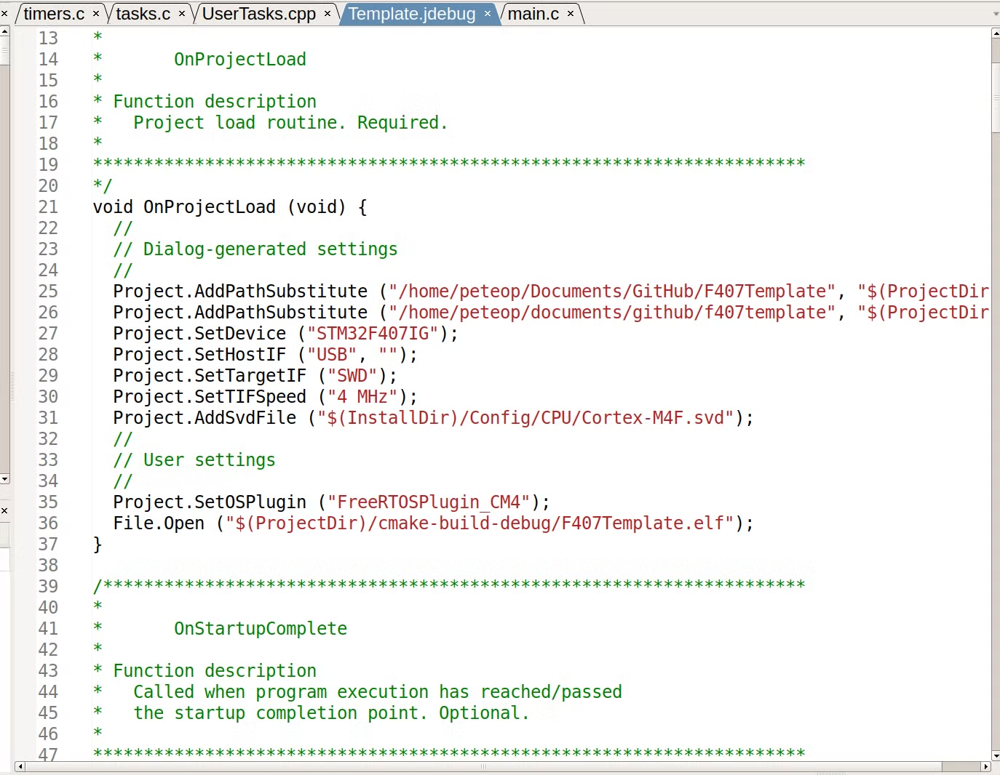

# Embedded Development Environment Installation

# STM32CubeMX

The first tool you will need is the STM32CubeMX. You can download it here:

[STM32CubeMX - STMicroelectronics](https://www.st.com/en/development-tools/stm32cubemx.html)

Download the suitable version for your system. We Use Version **6.6.1**!

After downloading just install it using the default options.

CubeMX is used to set up the processor on board and copy default HAL libraries for our projects.

# ARM Compiler

STM32 is an ARM-based processor. Thus normal compilers such as GCC on our system (usually x86) cannot compile code for it. We need cross-compilation to compile source code for ARM on an x86 machine. For this, we need the GNU ARM compiler. Another option is clang, but we will go with GNU for now.

Download the GNU Arm toolchain here:

[Arm GNU Toolchain Downloads - Arm Developer](https://developer.arm.com/downloads/-/arm-gnu-toolchain-downloads)

**Use the latest version for bare-metal targets (arm-none-eabi).**

After installation (take note of where it is installed). Test if the compiler is added to your PATH by:

```bash
arm-none-eabi-gcc -v
```

This should tell you your version of the ARM GNU GCC compiler. If an error pops up, make sure to add where you installed it to your system PATH. (Default is in /Applications/ARM/bin for Mac users)

# CLion

We use CLion for development. Download it from JetBrains. After you have downloaded it, clone our [template repo](https://github.com/RM-GT/F407Template) with the recursive option.

Then open up the whole folder with CLion.

A first-time opening of CLion would ask you to select the build tools. The default is file since we will specify our compiler in the CMake file later.

After you open the project folder for the first time, CLion will ask you for the CMake build type specification. The default (debug) is fine. You can just continue to open the project and wait for CLion to configure things for you.

After all the indexing and other auto-configurations by CLion are done, navigate to CMake on the bottom bar. A successful CMake configuration would look like this:



Next, you can try to compile the code with the hammer icon on the top right. If everything goes well, CLion will output something on the bottom area telling you that things have been compiled properly.



The .elf is the binary file compiled by our compiler. Next, I will show you how to download the firmware to our target board and debug with your code.

# J-Link

J-Link is the debug probe that we use to flash our firmware. Download two things from the following website:

[J-Link / J-Trace Downloads](https://www.segger.com/downloads/jlink/)

1. **J-Link Software and Documentation Pack**
2. **Ozone - The J-Link Debugger**
3. Optional (Systemview)

Install the J-Link Software first as it contains drivers. Then install Ozone.

Ozone is the flashed as well as a debugger for our firmware.

1. Connect a J-Link to your computer.
2. Select the right chip type (Board C is STM32F407IG



1. Next step, configure as follows. If you have a J-Link connected, it should show up in the emulator list.



1. Next step open up the elf binary file that we just compiled.
2. For optional settings, use the default.
3. When you open the project for the first time, you might be shown an error that FreeRTOS awareness is not enabled. To enable it, press apply the fix up. Next, modify this line (Project.SetOSPlugin ("FreeRTOSPlugin");) in the jdebug configuration file for your project’s line by adding _CM4 to the original string. 



1. Now you will be able to download the firmware by pressing the start button on the top left corner of the interface. After flashing is complete, the button will become a play button. Press play to start the program on board.
2. Next you can open up the UserTasks.cpp file using file→open. Add break points in a task’s loop to start debugging.
3. Most of the things we need are hidden in the view menu. I personally add stack and local data, global data, timeline, and watched data for debugging.