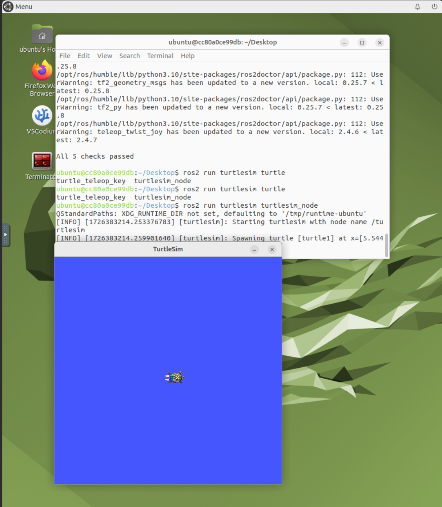

# Installation

This document will run you through of process of setting up environment to run RoboRambler's Software Stack.

## OS Installation

You will need a working [Ubuntu 22.04](https://releases.ubuntu.com/jammy/) OS to run our control stack, simulation, and hardware interface.

You have two options:

- Use native installation or [Windows Subsystem for Linux](https://learn.microsoft.com/en-us/windows/wsl/install) (Recommended).
- Use a NoVNC server installation with [Docker](https://www.docker.com/) (Slow, Not Recommended).

For native installation (on a brand-new computer or dual-booting with Windows), check [this tutorial](https://www.tomshardware.com/how-to/dual-boot-linux-and-windows-11). For NoVNC server installation, checkout [this separate document](no-vnc.md).

!!! warning
    Dual-booting means you have to mess-around with your existing OS and data. **THIS WILL BRING POTENTIAL HAZARDS TO YOU DATA AND IT CAN BE IN-RECOVERABLE.** Always make you fully understand the potential risk dual-booting brings, and always back-up your drive and data. If you are not sure about any step inside dual-booting, ask someone with experience.


## ROS2 Installation

RoboRambler uses [Robot Operating System](https://www.ros.org/), version [Humble Hawksbill](https://docs.ros.org/en/humble/index.html) (humble for short). To install ROS2 humble, please check [the official installation guide](https://docs.ros.org/en/humble/Installation/Ubuntu-Install-Debs.html).

Note that if you followed the NoVNC installation procedure above, you already have ROS2 installed.

To check if ROS2 installation is successful, open command terminal and type:

```bash
ros2
ros2 run turtlesim turtlesim_node
```

You should be able to see the prompt printed first, then a blue window showing a turtle inside it, like shown below.



## Pulling and Building Rambler Software

Now you have ROS2 installed. It's time to pull and setup our software!

### Tools and Utilities

Let's first install all the compilation tools and utilities. In RoboRambler, we use [Clang](https://clang.llvm.org/) based on LLVM. Clang is a faster, modern, and feature-rich complication and development tool set. However, for potential compatibility issues, we will also install the basic [GNU Complier Collection](https://gcc.gnu.org/).

```bash
# install gcc, most linux distro have it by default
sudo apt-get install build-essential

# install clang-18
wget https://apt.llvm.org/llvm.sh
chmod u+x llvm.sh
sudo ./llvm.sh 18

# test if installation is successful
gcc --version
g++ --version
clang-18 --version
clang-cpp-18 --version 
```

If everything above run without error, then your complication tool installation is successful.

Next, we are going to install [Git](https://git-scm.com/). Git is a distributed version control system. Type in:

```bash
sudo apt-get install git
git --version
```

Next, we are going to install [Visual Studio Code](https://code.visualstudio.com/) (VSCode for short), which is a great editor for C++ and ROS development. Check [this site](https://code.visualstudio.com/docs/setup/linux) for detailed install instruction. Here we list a snippet of code for apt-based installation.

```bash
echo "code code/add-microsoft-repo boolean true" | sudo debconf-set-selections
sudo apt-get install wget gpg

wget -qO- https://packages.microsoft.com/keys/microsoft.asc | gpg --dearmor > packages.microsoft.gpg
sudo install -D -o root -g root -m 644 packages.microsoft.gpg /etc/apt/keyrings/packages.microsoft.gpg
echo "deb [arch=amd64,arm64,armhf signed-by=/etc/apt/keyrings/packages.microsoft.gpg] https://packages.microsoft.com/repos/code stable main" |sudo tee /etc/apt/sources.list.d/vscode.list > /dev/null
rm -f packages.microsoft.gpg

sudo apt install apt-transport-https
sudo apt update
sudo apt install code
```

After installation, go to a directory you want, and type in `code .`. You should see the VSCode GUI interface popping up. Setup you VSCode by installing the following plugins:

- Clangd (For C/C++ code insights, analysis, formatting and auto-completion)
- Python (For Python code insights & auto-completion)
- ROS (For ROS development)
- Docker (Optional, for connecting to images)

For all plugins, check to have *Microsoft* has the author.

Note that if you are running NoVNC installation, it is also possible to directly attach to the running container (so you don't need to have VSCode installed inside NoVNC for code editing!) After installing the Docker plugin, just right click on the running image and choose *"Attach Visual Studio Code"*.

Finally, there's an optional bash configuration file you may want to have. ROS2 package complication always has a long line of arguments - which makes quick testing and prototyping really painful. By inserting these lines into the `~/.bash_aliases` file, you are able to use shortcuts.

```bash
export CC=clang-18
export CXX=clang++-18
export CMAKE_C_COMPILER=clang-18
export CMAKE_CXX_COMPILER=clang++-18
# export CC=gcc
# export CXX=g++
# export CMAKE_C_COMPILER=gcc
# export CMAKE_CXX_COMPILER=g++

alias bd='colcon build --symlink-install --cmake-args -DCMAKE_BUILD_TYPE=Debug -DCMAKE_EXPORT_COMPILE_COMMANDS=ON -DCMAKE_CXX_FLAGS="-w -O0 -g"'
bds() {
  colcon build --symlink-install --cmake-args -DCMAKE_EXPORT_COMPILE_COMMANDS=ON -DCMAKE_CXX_FLAGS="-w -O0" --packages-select=$1
}
alias bd-release='colcon build --symlink-install --cmake-args -DCMAKE_EXPORT_COMPILE_COMMANDS=ON -DCMAKE_BUILD_TYPE=RelWithDebInfo'
alias rs="source install/setup.bash"
alias rclean="rm -r build/ log/ install/"
alias rosdepinstall="rosdep install --from-paths src --ignore-src -r -y"

alias bashconfigalias="code ~/.bash_aliases"
alias bashconfig="code ~/.bashrc"
alias bashconfigup="source ~/.bashrc"
```

Note that you may change these aliases to anything you like. In the following document we are going to list full command, without any alias usage.

### Git SSH-Key Setup

To pull code from git, we need a way for our computer to be authenticated as being owned by you. The authentication method we usually use is **Secure Shell Protocal** (ssh for short). To set up ssh for GitHub, check out [how to generate it](https://docs.github.com/en/authentication/connecting-to-github-with-ssh/generating-a-new-ssh-key-and-adding-it-to-the-ssh-agent), and [how to add a new key to your GitHub Account](https://docs.github.com/en/authentication/connecting-to-github-with-ssh/adding-a-new-ssh-key-to-your-github-account).

### Code-base Setup

First, go to a directly you want the code base to be. Then, run the following commands:

```bash
mkdir -p rm_ws/src
cd rm_ws/src
```

We just created a ROS2 workspace named `rm_ws`, and has entered the source code directly `src`.

!!! note
    In ROS2 development, the so-called *Workspace Directory* or *Project Directory* always refer to level like `rm_ws` we just created. It is **above** the `src` directory. For any complication, **Only do it when you are under the Workspace Directory**, or you will find that you have a lot of miss-placed files.

Inside `src`, we are going to pull all the code we have right now. Make sure you have access to our repositories, and you are under `src` directory, and type in the following command:

```bash
# init repo
git init

# pull codes
git submodule add git@github.com:RM-GT/rm_common.git
git submodule add git@github.com:RM-GT/rm_controllers.git
git submodule add git@github.com:RM-GT/rm_hw.git
git submodule add git@github.com:RM-GT/rm_vision.git
git submodule add git@github.com:RM-GT/rm_descriptions.git
git submodule add git@github.com:RM-GT/rm_utils.git

# pull external dependencies
mkdir ext && cd ext
git submodule add git@github.com:robomaster-oss/rmoss_core.git
git submodule add git@github.com:robomaster-oss/rmoss_interfaces.git
git submodule add git@github.com:RoverRobotics-forks/serial-ros2.git

# install parsing utility package for python
pip install Cheetah3
```

After successful pulling, return to the workspace directory. Then, we are going to use ROS2's package management tool `rosdep` to automatically fetch all the external dependencies.

```bash
rosdep init
rosdep install --from-paths src --ignore-src -r -y
```

You should see `#All required rosdeps installed successfully` at the end.

Finally we are able to build the code base!

```bash
# setup compliers
export CC=clang-18
export CXX=clang++-18
export CMAKE_C_COMPILER=clang-18
export CMAKE_CXX_COMPILER=clang++-18

# build the project!
colcon build --symlink-install --cmake-args -DCMAKE_BUILD_TYPE=Debug -DCMAKE_EXPORT_COMPILE_COMMANDS=ON -DCMAKE_CXX_FLAGS="-w -O0 -g"
```

